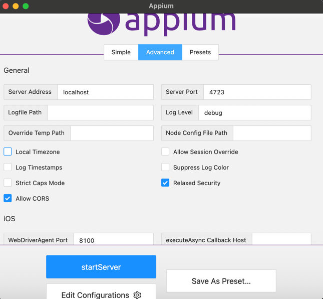

# Score Application Automation

This Framework is built to automate the Android Score Application.

The tech stack it is built on is:

1. [Java 11](https://www.oracle.com/java/technologies/javase/jdk11-archive-downloads.html)
2. [Appium Framework](https://appium.io/)
3. [Maven](https://maven.apache.org/)

This is designed as a hybrid framework with loose coupling and lean code base. The framework is designed using
page object factory model. This helps to maintain the code clean and well segmented i.e. if we make change to
a test case or a test suite it won't impact other parts of the framework.

In order to get started with the framework, you need to install the required dependencies.

- [Java 11](https://www.oracle.com/java/technologies/javase/jdk11-archive-downloads.html)
- [Appium Server](https://github.com/appium/appium-desktop/releases/tag/v1.22.3-4)
- [Maven](https://maven.apache.org/)
- [Appium Inspector](https://github.com/appium/appium-inspector/releases)
- [Android Studio](https://developer.android.com/studio)

### Setup the environment

For MacOS, you need to set the following environment level configuration:

First you need to check which is the active shell. In order to figure that out, execute the following command:
```
$ echo $SHELL
```
Depending on that either you would need to set bash or zsh as the active shell. Open the terminal and execute the following command:

```
vi  ~/.bash_profile
```
OR
```
vi ~/.zshrc
```
OR
```
vi ~/.zshenv
```
**Press I**, add the following configuration to the file related to Android Sdk, JAVA and MAVEN.
This is a sample. You would need to figure out the paths in your system.

```
export JAVA_HOME=$(/usr/libexec/java_home)
export MAVEN_HOME=/Users/{USERNAME}/Maven/apache-maven-3.8.5
export M2=$MAVEN_HOME/bin
export ANDROID_HOME=/Users/{USERNAME}/Library/Android/sdk/
export PATH=$PATH:/usr/local/git/bin:/usr/local/bin:
export PATH=$PATH:$ANDROID_HOME/platform-tools
export PATH=$PATH:$ANDROID_HOME/tools
export PATH=$PATH:$ANDROID_HOME/tools/bin
export PATH=$PATH:$ANDROID_HOME/emulator
```
After adding this press **ESC** and write **:wq** to save the file. Then close the file. And the content is saved for
that terminal session. In order to persist the changes, execute one of the following command:
```
source ~/.bash_profile 
OR 
source ~/.zshrc 
OR 
source ~/.zshenv
```
Recommended to restart the system once all the configuration is completed.

Create an avd using the Android Studio AVD manager.
1. Open Android Studio > Virtual Devices > Create AVD

2. Select the target device and click **Create**.

3. Select the **Android SDK** and click **Next**.

4. Select the **API Level** and click **Next**.

5. Select the **Device** and click **Next**.

6. Select the **Screen Size** and click **Next**.

7. And finally click **Finish**.

Open the AVD created in the previous step.

Emulator will be opened like this.


### Setup the Appium Desktop
After installation of the Appium server, you need to start the server.

1. Open the Appium Server

2. Edit the Host and Port. Set Host to localhost and Port to 4723.
3. Click on **Advanced** tab. Check on Allow CORS and Relaxed Security options.

4. Click on **Start**.


### Setup the Appium Inspector
After installation of the Appium Inspector, you need to start the server. So connection can be made.
Appium inspector helps to get the locators of the elements.

1. Open the Appium Inspector

2. Set the Remote host to localhost and Port to 4723.
3. Add the desired capabilities.
   - **appium:deviceName** is the name of the emulator.
   - **appium:platformName** is the name of the platform.
   - **appium:automationName** needs to be set to **UiAutomator2**.
   - **appium:app** is the path of the apk file.
4. Click on **Connect**.

```
{
  "appium:deviceName": "Score",
  "appium:app": "/Users/{username}/Appium/thescore-22-7-0.apk",
  "appium:automationName": "uiautomator2",
  "platformName": "Android"
}
```

### To run the tests

##### **In this framework, we don't need to run the appium server manually.** We can start the server and run the tests directly from the command line. 

The framework will take care of the rest. But before running the tests, you need to install the required dependencies as stated above
and your emulator needs to be running.

Note: The Device name is the name of the emulator. You will need this name to run the tests.

In your terminal, execute the following command:
**{NAME_OF_THE_DEVICE}** - Enter your emulator name
```
mvn test -DdeviceName={NAME_OF_THE_DEVICE}
```
Please find below reference to the execution of the test case on an emulator

[Test Case Execution](https://drive.google.com/file/d/1R5POjUj5ph8sx0YUD0-Tu3C9x_PksyNb/view?usp=sharing)

### Details related to the framework

Basic Structure of the framework is as follows:


- **Reports** - This is the folder where all the reports are generated. We are using 
extent-report to generate the reports.
- **base** - Driver base class is defined over here. The driver and server are initialized
over here along with other desired capabilities.
  - BaseDriver - Driver and server is initialized here.
  - ExtentReporter - Extent report is initialized here and integrated in the testng.xml.
  - Listeners - This is used to get the state of the testcases. So we can integrate the utility to take
  screenshots on failure.
- **data** - As data needs to be fed to the test cases, we are using the data provider so 
loose coupling is maintained. 
- **pages** - All the page objects and other methods related to that is maintained in pages.
the segmentation is based on the different screens of the application.
- **conf** - We cannot hardcode the details in the base driver. So we are using the config to provide
them externally.
  - application refers to the name of the apk
  - device refers to the name of the emulator
  - applicationPath refers to the path of the apk
  ```
  application=thescore-22-7-0.apk
  applicationPath=src
  device=Score
  ```
- **utils** - Utility methods are defined over here.
- **tests** - Test cases are defined over here and can be further divided into different groups.
- **pom.xml** - This file is used to resolve the dependencies.
- **testng.xml** - This file is used to execute the test cases.

# Approach of design and strategy

This framework is designed to be used in the automation of the mobile application. Based on Risk based analysis
of the application we can start to automate those test cases. The Automated test case is specifically designed to follow exact user interactions,
so we can replicate the user behavior. If there are any issues in the application, those could be fixed in an early stage. 
Moreover, assertions placed are not static because if some other team is searched the test case should not fail. 
So the assertions are placed are build on display of a certain elements which are common on that specific screen irrespective of the team.